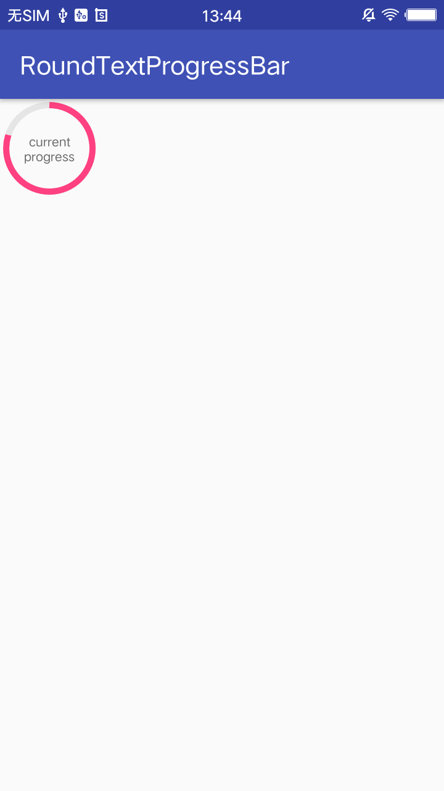

# RoundTextProgressBar
the text in the center of progress bar

    <custom.RoundProgressBar
        android:id="@+id/pb_driver_score"
        android:layout_width="80dp"
        android:layout_height="80dp"
        android:layout_marginStart="16dp"
        android:layout_marginTop="12dp"
        android:padding="16dp"
        app:backgroundColor="@color/color_E5E5E5"
        app:currentProgress="0"
        app:fromDegree="-90"
        app:progressColor="@color/colorAccent"
        app:progressTextSize="10"
        app:progressWidth="10" />

